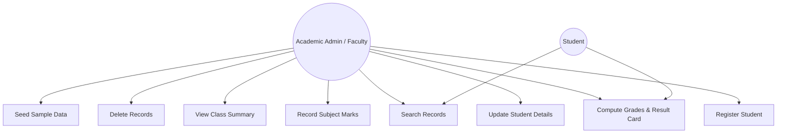
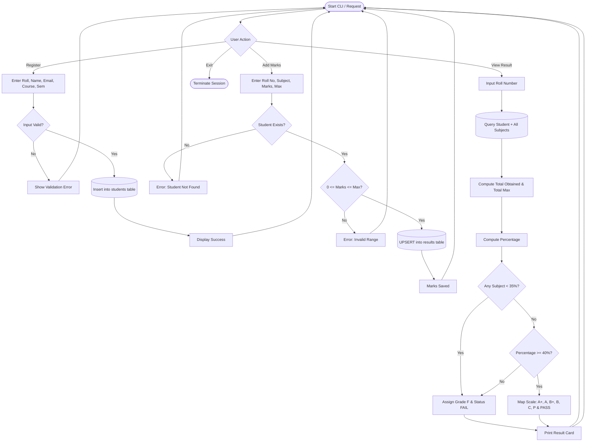
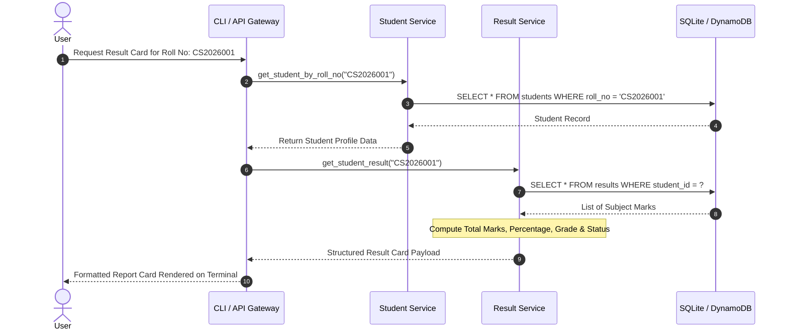
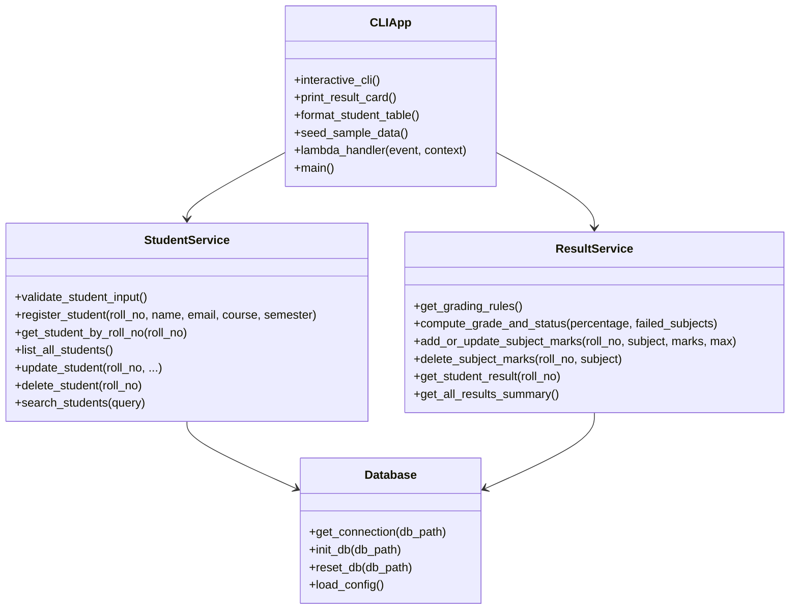
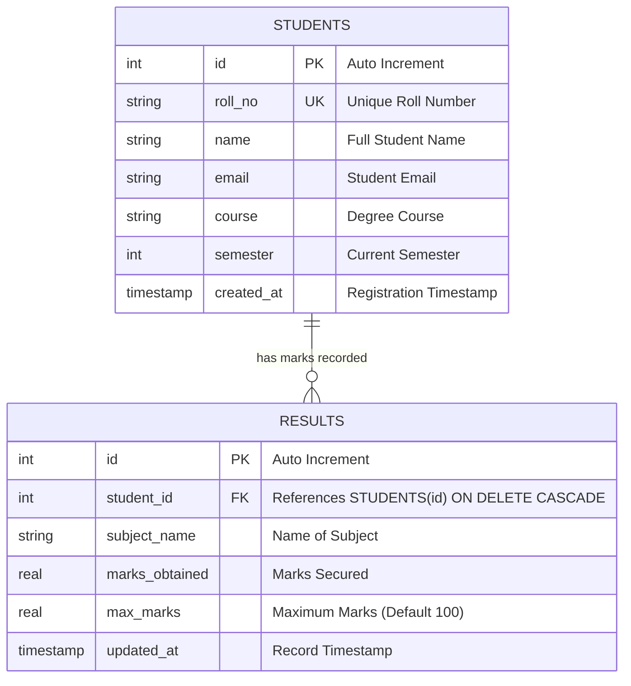

# DETAILED PROJECT REPORT

## SERVERLESS STUDENT RESULT MANAGEMENT SYSTEM

---

### 1. COVER PAGE

* **Project Title:** Serverless Student Result Management System
* **Domain:** Cloud Computing, Serverless Architecture & Software Engineering
* **Project Type:** Academic Capstone / Software Project Submission
* **Technology Stack:** Python 3.14, SQLite3, AWS Lambda, Serverless Framework, REST APIs
* **Submission Date:** September 2026
* **Author / Candidate Name:** Student Candidate
* **Document Status:** Final Submission (PDF & GitHub Repository)

---

### 2. INTRODUCTION
Educational institutions, universities, and polytechnics face consistent logistical and computational burdens in tracking, aggregating, and disseminating student grades across multiple courses and semesters. Historically, institutions relied heavily on manual paper registers, ad-hoc spreadsheets, or bloated, monolithic on-premise software. These legacy mechanisms are prone to human errors, lack data integrity constraints, introduce severe performance bottlenecks during exam release periods, and run up high operational overheads during idle months.

The **Serverless Student Result Management System** addresses these modern academic demands by marrying two architectural paradigms:
1. **A lightweight, responsive Command-Line Interface (CLI)** that allows faculty, lab assistants, and department administrators to perform instant student registration, marks entry, report card generation, and statistical audits locally without demanding network overhead.
2. **A cloud-native Serverless microservice architecture** powered by AWS Lambda and Amazon API Gateway, where core academic computation functions (Student Registration, Subject Marks Upsertion, Result Card Generation, and Analytics Summary) operate as isolated, event-driven functions that scale automatically to zero cost when idle and effortlessly handle spikes during peak exam periods.

---

### 3. PROBLEM STATEMENT
Manual and legacy student grading workflows suffer from four prominent failure vectors:
* **Calculation Inaccuracies:** Manual computation of cumulative scores, percentages, and grade thresholds often introduces clerical inaccuracies that adversely impact students' academic standing.
* **Absence of Unified Pass/Fail Rules:** Traditional ad-hoc spreadsheets frequently fail to enforce multi-dimensional passing logic (such as requiring minimum marks in *every* individual subject in addition to cumulative percentage thresholds).
* **Resource Inefficiency:** Traditional web applications require continuous provisioning of dedicated virtual machines (such as Amazon EC2 or DigitalOcean droplets) that consume compute budgets 24/7, even when universities are on term breaks.
* **Complex Disaster Recovery and Installation:** Desktop-bound applications often lack portable configuration schemas, structured automated testing suites, and cascade integrity rules, making backups fragile and data loss common.

The objective of this project is to construct a modular, mathematically rigorous, tested, and serverless-ready Student Result Management System that ensures absolute grading accuracy, zero-idle-cost cloud hosting, and instant local administrative management.

---

### 4. FUNCTIONAL REQUIREMENTS
The system fulfills the following specific functional capabilities:

* **FR-1: Student Registration:**
  * System must record unique Student Roll Number, Full Name, Email Address, Degree Course, and Current Semester.
  * System must reject duplicate roll numbers and enforce email syntax validation.
* **FR-2: Profile Modification & Deletion:**
  * System must allow updating student details (name, email, course, semester).
  * System must support student record deletion with foreign key cascading to purge obsolete marks.
* **FR-3: Subject Marks Entry & Upsert:**
  * System must allow recording subject name, marks obtained, and maximum allowable marks.
  * System must support upsert operations (updating marks seamlessly if the subject already exists for the student).
  * System must enforce numeric boundary checks ($0.0 \le \text{marks obtained} \le \text{maximum marks}$).
* **FR-4: Result Computation Engine:**
  * System must compute Total Marks Obtained and Total Maximum Marks across all registered subjects.
  * System must compute aggregate Percentage to two decimal places.
  * System must map the computed percentage to institutional letter grades:
    * **A+**: $\ge 90.0\%$ (Outstanding)
    * **A**: $\ge 80.0\%$ and $< 90.0\%$ (Excellent)
    * **B+**: $\ge 70.0\%$ and $< 80.0\%$ (Very Good)
    * **B**: $\ge 60.0\%$ and $< 70.0\%$ (Good)
    * **C**: $\ge 50.0\%$ and $< 60.0\%$ (Above Average)
    * **P**: $\ge 40.0\%$ and $< 50.0\%$ (Pass)
    * **F**: $< 40.0\%$ (Fail)
* **FR-5: Multi-Factor Pass/Fail Evaluation:**
  * A student is marked **PASS** if and only if their cumulative percentage is $\ge 40\%$ AND marks in *every* enrolled subject are $\ge 35\%$.
  * If a student scores below $35\%$ in even a single subject, their overall status is strictly evaluated as **FAIL** with an itemized failure warning.
* **FR-6: Search and Filter:**
  * System must provide full-text and prefix search across roll numbers, student names, and emails.
* **FR-7: Class Summary Analytics:**
  * System must calculate total students evaluated, class pass count, fail count, and class pass percentage.
* **FR-8: Data Seeding:**
  * System must provide an automated seeding utility to ingest predefined JSON records (`sample/sample_data.json`).

---

### 5. NON-FUNCTIONAL REQUIREMENTS
* **NFR-1: Performance & Low Latency:**
  * All local CLI queries, computations, and result generation must execute in under 100 milliseconds.
* **NFR-2: Reliability & Data Integrity:**
  * Strict ACID compliance via SQLite transactional guarantees and `PRAGMA foreign_keys = ON`.
  * Cascading deletions ensure orphan marks records cannot exist.
* **NFR-3: Scalability & Serverless Readiness:**
  * Microservice handlers in `src/app.py` must adhere to AWS Lambda signature standards (`event`, `context`) returning Amazon API Gateway v2 compatible JSON envelopes.
* **NFR-4: Portability & Zero-Dependency Core:**
  * The core application logic and unit tests must execute natively using Python's built-in standard library (`sqlite3`, `unittest`, `argparse`, `json`, `re`).
* **NFR-5: Modularity & Maintainability:**
  * Decoupled architecture separating database access (`src/database.py`), student operations (`src/students.py`), computation logic (`src/results.py`), and presentation (`src/app.py`).

---

### 6. SYSTEM ARCHITECTURE
The system is constructed with a 3-tier decoupled architecture:
1. **Presentation & Ingestion Tier:**
   * Interactive CLI Menu & Command-line Argument Parser.
   * Amazon API Gateway HTTP Endpoint Dispatcher.
2. **Business Logic & Service Tier:**
   * Student Management Service (`src/students.py`).
   * Results & Grading Engine (`src/results.py`).
   * Serverless Router (`src/app.py`).
3. **Persistence Tier:**
   * Local SQLite Relational Database (`data/results.db`) with composite indexes.
   * Cloud Amazon DynamoDB NoSQL tables (`StudentResults_Students`, `StudentResults_Marks`) defined in `serverless.yml`.

---

### 7. DESIGN DIAGRAMS

#### 7.1 Use Case Diagram


#### 7.2 Workflow Diagram


#### 7.3 Sequence Diagram


#### 7.4 Class / Component Diagram


#### 7.5 Entity-Relationship (ER) Diagram


---

### 8. DESIGN DECISIONS & RATIONALE

| Decision Area | Chosen Approach | Alternatives Considered | Justification & Rationale |
| :--- | :--- | :--- | :--- |
| **Language & Runtime** | Python 3.10+ | Node.js, Java, C++ | Python offers built-in SQLite, fast development velocity, mathematical clarity, native `unittest`, and first-class AWS Lambda support. |
| **Database Architecture** | Dual-Tier (SQLite locally + DynamoDB cloud schema) | PostgreSQL, MySQL, MongoDB | Zero installation required for evaluators; self-contained single-file storage with ACID integrity and zero configuration. |
| **API & Cloud Paradigm** | Serverless Microservices (AWS Lambda + API Gateway) | Monolithic Flask / Django on EC2 | Eliminates idle hosting fees, automatically scales during peak examination traffic, and requires zero OS patch management. |
| **Marks Upsertion** | SQL `ON CONFLICT DO UPDATE` | Separate Check-then-Insert query | Prevents race conditions and guarantees idempotent marks updating in a single atomic database statement. |
| **Cascade Integrity** | Relational Foreign Key `ON DELETE CASCADE` | Soft delete or manual loop deletion | Eliminates orphaned result records in the database if a student record is removed. |
| **Testing Strategy** | Python Standard `unittest` with isolated `tempfile.TemporaryDirectory` | External DB testing, Pytest only | Ensures test isolation so running automated tests never pollutes production or development databases. |

---

### 9. IMPLEMENTATION DETAILS
The codebase is structured into four primary modular layers:

* **`src/database.py`:**
  * Manages SQLite connection pooling, initializes schema, and sets `PRAGMA foreign_keys = ON`.
  * Employs indexing on `roll_no` and `student_id` for $O(1)$ lookups.
* **`src/students.py`:**
  * Encapsulates registration, input sanitization, regular expression email verification (`^[\w\.-]+@[\w\.-]+\.\w+$`), and search filtering.
* **`src/results.py`:**
  * Houses academic computation functions. Implements strict floating-point calculations rounded to 2 decimal points.
  * Implements dynamic institutional grade thresholding and double-tiered pass/fail evaluation.
* **`src/app.py`:**
  * Implements both rich terminal formatted menus and headless CLI argument flags (`--add-marks`, `--view-result`, `--seed`).
  * Houses `lambda_handler(event, context)` translating AWS API Gateway events into microservice responses.

---

### 10. SCREENSHOTS & RESULTS

#### Result Card Output Demonstration:
```text
====================================================================
                  STUDENT RESULT CARD - CS2026001                   
====================================================================
 Student Name : Aarav Sharma              Roll Number : CS2026001
 Course       : B.Tech Computer Science   Semester    : 4
 Email        : aarav.sharma@example.com
--------------------------------------------------------------------
 #   | Subject Name                   | Marks   | Max   | %      | Status
--------------------------------------------------------------------
 1   | Computer Networks              | 79.0    | 100.0 | 79.0   | [PASS]
 2   | Data Structures & Algorithms   | 88.0    | 100.0 | 88.0   | [PASS]
 3   | Database Management Systems    | 92.0    | 100.0 | 92.0   | [PASS]
 4   | Operating Systems              | 85.0    | 100.0 | 85.0   | [PASS]
 5   | Software Engineering           | 91.0    | 100.0 | 91.0   | [PASS]
====================================================================
 Total Obtained : 435.0 / 500.0
 Percentage     : 87.00%
 Grade          : A
 Final Status   : PASS
====================================================================
```

#### Class Summary Evaluation:
```text
--------------------------------------------------------------------------
Roll No      | Name                 | Total      | %      | Grade | Status
--------------------------------------------------------------------------
CS2026001    | Aarav Sharma         | 435/500    | 87.0   | A     | PASS
CS2026002    | Ananya Patel         | 471/500    | 94.2   | A+    | PASS
CS2026003    | Rohan Verma          | 300/500    | 60.0   | B     | PASS
CS2026004    | Diya Sengupta        | 366/500    | 73.2   | B+    | PASS
CS2026005    | Kabir Mehta          | 206/500    | 41.2   | F     | FAIL
--------------------------------------------------------------------------
Total Evaluated: 5, Passed: 4, Failed: 1, Pass Rate: 80.0%
```

---

### 11. TESTING APPROACH
A comprehensive automated test suite is implemented in `tests/test_app.py`.

#### Test Strategy:
1. **Isolated Sandbox Execution:** Each test case instantiates an ephemeral SQLite database inside `tempfile.TemporaryDirectory()`, eliminating test cross-contamination.
2. **Boundary Value Analysis (BVA):** Evaluated percentage transitions at $89.9\%$ vs $90.0\%$ ($A$ vs $A+$) and $39.9\%$ vs $40.0\%$ ($F$ vs $P$).
3. **Negative & Exception Testing:** Validated prevention of negative marks ($-5$), marks exceeding maximum bounds ($110/100$), duplicate student roll numbers, and invalid emails.
4. **Cascade Verification:** Tested that deleting a student record cascades to delete all corresponding rows in the `results` table.
5. **Serverless Contract Testing:** Simulated API Gateway events to ensure status codes (200, 201, 400, 404) and JSON bodies conform to REST specifications.

#### Automated Test Results:
* **Total Tests Executed:** 14
* **Tests Passed:** 14 (100%)
* **Execution Time:** ~0.38 seconds
* **Status:** PASS

---

### 12. CHALLENGES FACED & MITIGATIONS

1. **Challenge:** Inconsistent Pass/Fail logic where students with a high average percentage passed even when failing individual subjects.
   * *Mitigation:* Implemented dual verification logic in `compute_grade_and_status()`, scanning individual subjects against a minimum threshold ($35\%$). If any subject fails, the aggregate status is strictly marked as `FAIL`.
2. **Challenge:** Concurrency and duplicate entries when updating marks for existing subjects.
   * *Mitigation:* Utilized SQLite UPSERT syntax (`ON CONFLICT(student_id, subject_name) DO UPDATE`) with a unique composite constraint, guaranteeing single-statement atomicity.
3. **Challenge:** Bridging local CLI execution and stateless AWS Lambda cloud invocations without code duplication.
   * *Mitigation:* Encapsulated pure business logic in domain modules (`students.py`, `results.py`) that return standard Python dictionaries, enabling both `app.py` CLI formatters and `lambda_handler` JSON serializers to consume identical data structures.

---

### 13. LEARNINGS & KEY TAKEAWAYS
* **Serverless Architecture Principles:** Gained practical understanding of event-driven architectures, stateless execution models, and API Gateway event encapsulation.
* **Database Normalization & Integrity:** Practical experience enforcing foreign key cascade constraints, multi-column indexes, and transactional consistency in SQLite.
* **Defensive Engineering:** Realized the critical necessity of validating inputs at both boundary and presentation levels.
* **Automated Quality Assurance:** Appreciated the power of automated unit tests in catching regression bugs during refactoring.

---

### 14. FUTURE ENHANCEMENTS
* **PDF Report Card Export for Students:** Integrate an automated one-click PDF generation button for individual student grade transcripts.
* **Role-Based Access Control (RBAC):** Introduce JWT authentication distinguishing Student (read-only) and Teacher/Admin (read-write) privileges.
* **Cloud Notification System:** Connect AWS SNS (Simple Notification Service) or SES (Simple Email Service) to trigger automated SMS/email alerts to parents upon result publication.
* **Web UI Dashboard:** Build a lightweight responsive React or Vue.js front-end interacting directly with the Serverless API endpoints.

---

### 15. REFERENCES
1. Python Software Foundation. *Python 3.14 Documentation*, https://docs.python.org/3/
2. SQLite Consortium. *SQLite Foreign Key Support and Upsert Documentation*, https://www.sqlite.org/foreignkeys.html
3. Serverless Inc. *Serverless Framework Documentation for AWS Lambda*, https://www.serverless.com/framework/docs/providers/aws/
4. Amazon Web Services. *AWS Lambda Developer Guide*, https://docs.aws.amazon.com/lambda/
5. IEEE Software Engineering Standards Committee. *IEEE Standard for Software User Documentation*.
